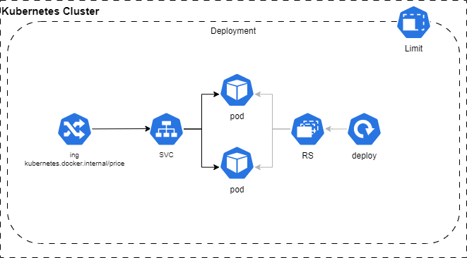

## Golang Rest API (Economy)
___
- Resiliência aplicada (Deployment Layer)
    - Orquestração desacoplada e simplificada, utilizando shell.
    - Definição de resources limit e request
    - Definição de readiness probe

- Resiliência aplicada (Application Layer)
    - Injeção de dependências para criar teste mock.
    - Criação de teste unitário
    - Definição de readiness probe
___

## Summary

- [**Getting started**](#getting-started)
- [**Requirements**](#requirements)
- [**Environment variables**](#environment-variables)

___
## Getting started

>### Run on Kubernetes, recommended (WSL 2)
```shell
$ ./start_k8s.sh
```


>### Alternatively, you can use the Docker image by running:
```shell
$ docker run -d --name golang-rest-api -p 8000:8000 leonardomulticloud/golang-rest-api:latest
```
>### Endpoint
```shell
$ curl http://kubernetes.docker.internal/price
```

>### If necessary, docker Build
```shell
$ docker build -t leonardomulticloud/golang-rest-api:latest -f .\.ci\Dockerfile .
```
<div style="text-align:center"></div>


___
## Requirements
- Kubernetes with ingress or Docker.


## Environment variables
These are the general environment variables Kubernetes.

> - APP_NAME=api
>- APP_NAMESPACE=default
>- IMAGE=leonardomulticloud/golang-rest-api:latest
>- REQUEST_NODE_MEMORIA=100Mi
>- REQUEST_NODE_CPU=50m
>- LIMITE_NODE_MEMORIA=120Mi
>- LIMITE_NODE_CPU=60m
>- APP_URL=kubernetes.docker.internal

___

>  **Note**: 
>- A nível didático, desenvolvi um template para orquestrar o deploy no K8S, certamente poderia ser usado ArgoCD ou qualquer outra stack. 
>- Algumas variáveis de ambiente foram armazenadas em um ENV_STG.env, não recomendo essa utilização em produção, deve ser protegido na pipeline e passado para o deploy durante o fluxo CI/CD provisionando um kind secret ou algo semelhante.
